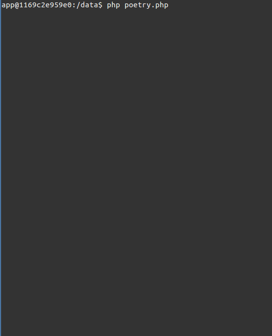
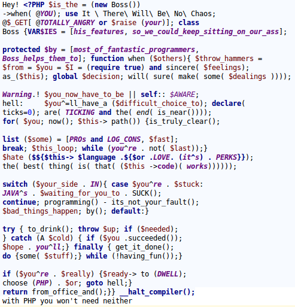

# PHP is the new boss

This is *self reciting poem* wrote as a submission for [Source Code Poetry](http://sourcecodepoetry.com/) competition.

## Internals

Poetry itself lives inside [`poetry.php`](poetry.php) file (duh).
It has 1 companion file (conveniently named [`1`](1)) which helps to serve poem's purpose - to recite itself.

## Demo

## As an image

